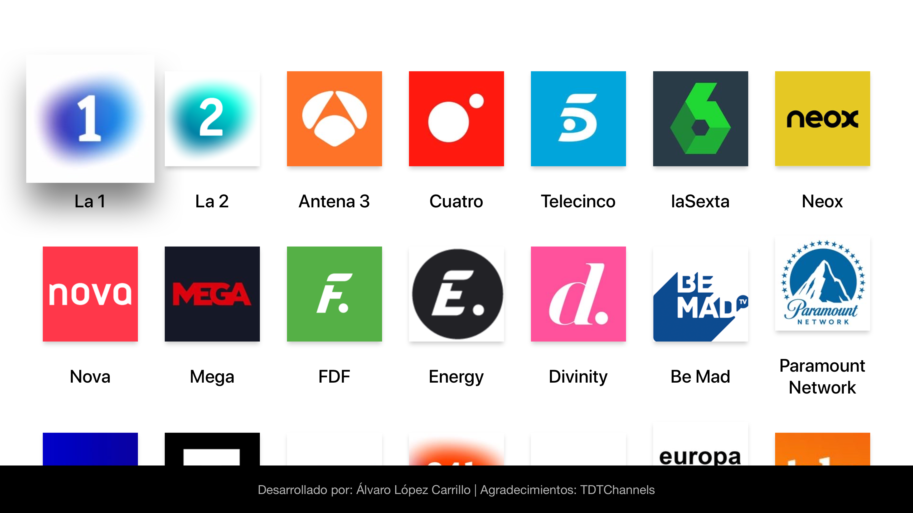

TDT Online España
=============

TDT Online España es una app para Apple TV 4 y superior totalmente gratuita y utilizando como fuente de datos TDTChannels. Disfruta de una app libre de publicidad y gratis. Logra instalarla con esta sencilla guía o visita el video para mayor comodidad.

**Creada en swift 5 de forma nativa y basada en TvOS 13.2**

Screenshots
---------

Guia de instalación
---------

* 1º - Descargar Xcode en nuestro Mac
* 2º - Clonar este repositorio en Xcode
* 3º - Iniciar sesión con nuestro Apple ID en Xcode -> Preferences -> Accounts y pulsamos en el '+'
* 4º - Vamos a la pestaña 'signing & capabilities' y seleccionamos el team personal que hemos iniciado, modificamos el bundle y dejamos por ejemplo: com.TU_NOMBRE.tdt, pulsamos en 'try again' y debe de quitarse el error de registro de bundle
* 5º - Pulsamos en la pestaña superior Windows -> Devices and simulators, al abrirse la ventana vamos a nuestro apple tv y entramos en Ajustes -> Mandos y dispositivos -> App Remote y dispositivos. Aqui aparecerá nuestro ordenador que tenemos con Xcode y tras enlazarlo aparecerá el Apple TV en la pantalla de Windows -> Devices and simulators de Xcode.
* 6º - Seleccionamos nuestro apple tv en la lista de dispositivos (en la zona superior izquierda) y pulsamos en el icono de play para compilar y ejecutar el código.
* 7º - Disfrutar de la TDT totalmente Gratis!

Video de instalación
---------

Otros
---------

Enlace del .ipa (no utilizar si no sabes que significa): [Aquí](https://iberianapps.com/proyectos/lopez/TDT%20Online%20Espan%CC%83a.ipa)
